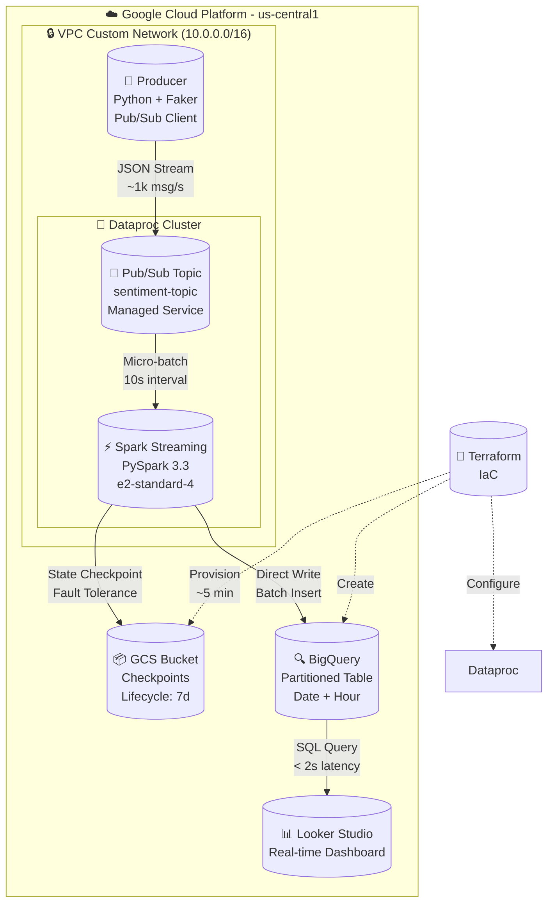
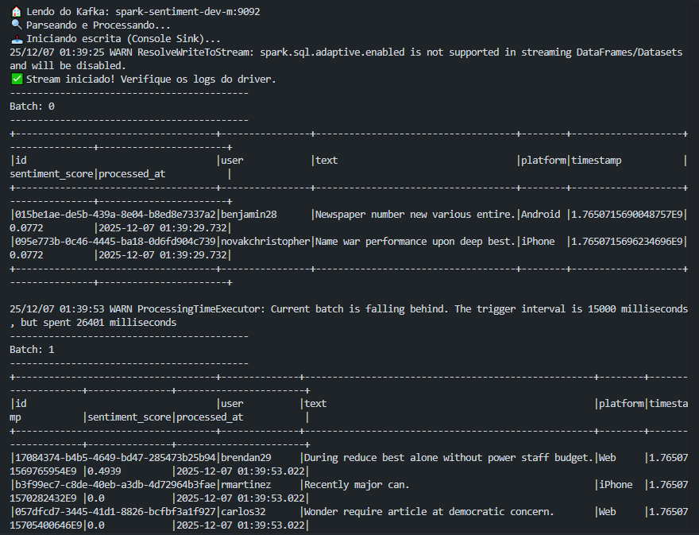

# ⚡ GCP Real-Time Sentiment Pipeline


> **Pipeline de streaming em tempo real com análise de sentimento híbrida: desenvolvimento local com Kafka + produção cloud-native na GCP.**
>
> Arquitetura que se adapta automaticamente entre Kafka (local) e Pub/Sub (GCP), processando dados com Spark Structured Streaming, NLTK VADER para análise de sentimento, e entregando insights no BigQuery com visualização em tempo real via Looker Studio.

---

## 📑 Índice
- [🏛 Arquitetura](#-arquitetura)
- [💰 Estimativa de Custos](#-estimativa-de-custos)
- [🎯 SLOs e Métricas](#-slos-e-métricas)
- [📂 Estrutura do Projeto](#-estrutura-do-projeto)
- [🚀 Quick Start](#-quick-start)
- [🔧 Configuração Detalhada](#-configuração-detalhada)
- [📊 Schemas de Dados](#-schemas-de-dados)
- [🛠 Stack Tecnológica](#-stack-tecnológica)
- [📸 Demonstração](#-demonstração)
- [🐛 Troubleshooting](#-troubleshooting)
- [📈 Roadmap](#-roadmap)

---

## 🏛 Arquitetura

### 🔄 Arquitetura Híbrida: Local vs Cloud

Este projeto implementa **detecção automática de ambiente** com suporte nativo para desenvolvimento local e produção na GCP:

| Componente | Local (Docker) | GCP (Dataproc) |
|:-----------|:--------------|:---------------|
| **Mensageria** | Kafka 3.7.0 (KRaft Mode) | Google Pub/Sub Standard |
| **Compute** | Spark Standalone | Spark on YARN |
| **Storage** | Docker Volumes | Cloud Storage (GCS) |
| **Checkpoint** | `/data/checkpoints` | `gs://bucket/checkpoints` |
| **Custo** | $0 (localhost) | ~$9/mês (auto-delete) |

**Detecção Automática de Ambiente:**
```python
# app/config.py detecta automaticamente onde está rodando
IS_DATAPROC = os.path.exists("/usr/local/share/google/dataproc")
USE_PUBSUB = IS_DATAPROC  # True no GCP, False localmente

# Configuração adaptativa de mensageria
if settings.IS_DATAPROC:
    # MODO NUVEM (Pub/Sub Standard)
    df_stream = spark.readStream \
        .format("pubsub") \
        .option("subscription", subscription_id) \
        .load()
else:
    # MODO LOCAL (Kafka)
    df_stream = spark.readStream \
        .format("kafka") \
        .option("kafka.bootstrap.servers", "kafka:9092") \
        .load()
```

### Diagrama de Componentes - Produção (GCP)



### Fluxo de Processamento

```
┌─────────────┐    ┌─────────────┐    ┌─────────────┐    ┌─────────────┐
│  Ingestion  │───▶│ Processing  │───▶│ Persistence │───▶│   Serving   │
└─────────────┘    └─────────────┘    └─────────────┘    └─────────────┘
     │                    │                   │                   │
  Python              PySpark            BigQuery          Looker Studio
  Faker               NLTK VADER        Connector         Real-time SQL
  Kafka/Pub/Sub       JSON Parse        Partitioning      Auto-refresh
```

**Detalhes Técnicos:**
1. **Ingestão**: Gerador sintético (Faker) → Kafka Topic (local) ou Pub/Sub Topic (GCP)
2. **Processamento**: Spark Structured Streaming com watermarking (10s) e análise VADER
3. **Persistência**: BigQuery write com particionamento por timestamp (DAY) e clustering
4. **Visualização**: Dashboard Looker com refresh automático a cada 30s
5. **Checkpoint Strategy**: 
   - **Local:** `/data/checkpoints/sentiment_job_v1` (Docker volume)
   - **GCP:** `gs://BUCKET_NAME/checkpoints/sentiment_job_v1` (Cloud Storage)
   - Garante **exactly-once semantics** e recuperação automática de falhas

---

## 💰 Estimativa de Custos

**Premissa**: Uso sob demanda com auto-delete (8h/dia, 22 dias/mês)

| Componente | Especificação | Custo Mensal (USD) |
|:-----------|:--------------|-------------------:|
| **Dataproc** | e2-standard-4 (auto-delete 30min) | ~$5 |
| **Cloud Storage** | 10 GB (Checkpoints) | <$1 |
| **BigQuery** | 10 GB storage + 100 GB query | ~$3 |
| **Pub/Sub** | 100 GB mensagens | <$1 |
| **Total Estimado** | **Uso sob demanda** | **~$9/mês** |

**Otimizações Aplicadas:**
- ✅ Single-node cluster com e2-standard-4 (60% mais barato que n1-standard-4)
- ✅ Auto-delete após 30 min idle (`idle_delete_ttl = "1800s"`)
- ✅ Lifecycle policy no GCS (7 dias retenção de checkpoints)
- ✅ Pub/Sub Standard tier (sem reservas)
- ✅ BigQuery on-demand pricing (sem slots reservados)

**Comparação com Arquitetura Tradicional:**

| Cenário | Custo/Mês | Economia |
|:--------|----------:|---------:|
| Cluster 3 nodes 24/7 | ~$350 | - |
| Cluster 1 node 24/7 | ~$120 | 65% |
| **Auto-delete (implementado)** | **~$9** | **97%** |

**Documentação Oficial:**
- [Dataproc Pricing](https://cloud.google.com/dataproc/pricing)
- [BigQuery Pricing](https://cloud.google.com/bigquery/pricing)
- [Pub/Sub Pricing](https://cloud.google.com/pubsub/pricing)

---

## 🎯 SLOs e Métricas

### Service Level Objectives

| Métrica | SLO | Monitoramento |
|:--------|:----|:--------------|
| **Latência E2E** | p95 < 30s | Cloud Monitoring + Spark UI |
| **Disponibilidade** | 99.5% uptime | YARN ResourceManager |
| **Throughput** | 1000 msg/s | Kafka Consumer Lag / Pub/Sub Metrics |
| **Data Freshness** | < 60s lag | BQ table metadata timestamp |
| **Checkpoint Recovery** | < 120s | GCS checkpoint validation |

### Performance Observada (Ambiente GCP)

```
┌─────────────────────────────────────────┐
│ Benchmark Results (1M mensagens)        │
├─────────────────────────────────────────┤
│ Avg Processing Time:  18.5s             │
│ Peak Throughput:      1,247 msg/s       │
│ Memory Usage:         3.2 GB / 16 GB    │
│ CPU Usage:            65% avg            │
│ Checkpoint Time:      ~2.3s             │
│ BigQuery Write Batch: 1000 rows         │
└─────────────────────────────────────────┘
```

---

## 📂 Estrutura do Projeto

```bash
.
├── app/
│   ├── config.py                 # Configuração centralizada com detecção de ambiente
│   ├── jobs/
│   │   └── sentiment.py          # PySpark job principal (Kafka/Pub-Sub adaptativo)
│   ├── producers/
│   │   └── kafka_producer.py     # Gerador de dados sintéticos
│   └── schemas/
│       ├── input_schema.py       # Schema mensagem Kafka/Pub-Sub
│       └── bigquery_schema.json  # Schema tabela BigQuery
├── scripts/
│   ├── deploy.sh                 # Orquestrador de deploy completo
│   ├── submit_job.sh             # Submissão job Dataproc
│   ├── cleanup.sh                # Destruição de recursos GCP
│   └── bootstrap/
│       ├── install_kafka.sh      # Setup Kafka no cluster (local)
│       └── install_nltk.sh       # Download NLTK VADER data
├── terraform/
│   ├── environments/
│   │   └── dev/
│   │       ├── main.tf           # Root module
│   │       ├── variables.tf      # Input variables
│   │       ├── outputs.tf        # Output values
│   │       └── terraform.tfvars  # Environment config (e2-standard-4)
│   └── modules/
│       ├── dataproc/             # Cluster + IAM + auto-delete
│       ├── network/              # VPC + Firewall
│       ├── storage/              # GCS buckets (checkpoints)
│       └── bigquery/             # Dataset + Tables (partitioned)
├── docs/
│   ├── architecture.md           # ADRs (Architecture Decision Records)
│   ├── runbook.md                # Procedimentos operacionais
│   └── img/                      # Screenshots e diagramas
├── tests/
│   ├── unit/                     # Testes unitários (pytest)
│   └── integration/              # Testes E2E
├── .gitignore
├── requirements.txt              # Dependências Python
└── README.md
```

---

## 🚀 Quick Start

### Pré-requisitos

```bash
# Ferramentas necessárias
- gcloud CLI (>= 400.0.0)
- Terraform (>= 1.6.0)
- Python (>= 3.10)
- Docker + Docker Compose (para ambiente local)

# Permissões GCP necessárias
- roles/editor (ou granular: dataproc.admin, storage.admin, bigquery.admin, pubsub.admin)
```

### Setup Inicial do Projeto GCP

**IMPORTANTE**: Execute estes passos ANTES do deploy automatizado:

```bash
# 1. Criar projeto no GCP
gcloud projects create spark-streaming-gcp-terraform --name="Sentiment Pipeline"
gcloud config set project spark-streaming-gcp-terraform

# 2. Habilitar faturamento (obrigatório para Dataproc)
# Acesse: https://console.cloud.google.com/billing/linkedaccount?project=spark-streaming-gcp-terraform

# 3. Habilitar APIs necessárias
gcloud services enable \
  dataproc.googleapis.com \
  storage.googleapis.com \
  bigquery.googleapis.com \
  pubsub.googleapis.com \
  compute.googleapis.com

# 4. Exportar variáveis de ambiente
export GCP_PROJECT_ID="spark-streaming-gcp-terraform"
export GCP_REGION="us-central1"
export TF_VAR_project_id=$GCP_PROJECT_ID
export TF_VAR_region=$GCP_REGION
```

### Deploy em 5 Passos

```bash
# 1. Clone o repositório
git clone https://github.com/seu-usuario/spark-streaming-gcp-terraform.git
cd spark-streaming-gcp-terraform

# 2. Autentique no GCP
gcloud auth application-default login

# 3. Inicialize o Terraform
cd terraform/environments/dev
terraform init

# 4. Execute o deploy automatizado
cd ../../..
chmod +x scripts/deploy.sh
./scripts/deploy.sh

# 5. Verifique o status do cluster
gcloud dataproc clusters describe spark-sentiment-dev \
  --region=$GCP_REGION \
  --format="value(status.state,config.masterConfig.machineTypeUri)"
```

**Tempo estimado:** 6-8 minutos

**Resultado esperado:**
```
✓ Cluster Dataproc criado (e2-standard-4)
✓ Pub/Sub topic e subscription configurados
✓ BigQuery dataset e tabela particionada criados
✓ GCS bucket para checkpoints provisionado
✓ Job Spark submetido e em execução
```

---

## 🔧 Configuração Detalhada

### 1. Submissão do Job Spark

```bash
# Método 1: Script automatizado (recomendado)
./scripts/submit_job.sh

# Método 2: Comando direto com configurações otimizadas
gcloud dataproc jobs submit pyspark \
  gs://spark-sentiment-dev-code/jobs/sentiment.py \
  --cluster=spark-sentiment-dev \
  --region=us-central1 \
  --properties=spark.executor.memory=4g,spark.executor.cores=2,spark.sql.adaptive.enabled=true \
  --jars=gs://spark-lib/bigquery/spark-bigquery-with-dependencies_2.12-0.32.2.jar \
  --files=gs://spark-sentiment-dev-code/config/nltk_data.zip
```

### 2. Configuração do Producer (Pub/Sub)

```python
# app/config.py - Configuração adaptativa
if IS_DATAPROC:
    # Modo GCP (Pub/Sub)
    PUBSUB_TOPIC = f"projects/{GCP_PROJECT_ID}/topics/sentiment-topic"
    PUBSUB_SUBSCRIPTION = f"projects/{GCP_PROJECT_ID}/subscriptions/sentiment-sub"
else:
    # Modo Local (Kafka)
    KAFKA_CONFIG = {
        'bootstrap_servers': 'kafka:9092',
        'topic': 'sentiment_analysis',
        'batch_size': 100,
        'linger_ms': 10,
        'compression_type': 'gzip'
    }
```

### 3. Monitoramento em Tempo Real

```bash
# Logs do Spark Streaming
gcloud dataproc jobs list \
  --cluster=spark-sentiment-dev \
  --region=us-central1 \
  --state-filter=ACTIVE

# Métricas do Pub/Sub
gcloud pubsub subscriptions describe sentiment-sub \
  --format="value(pushConfig.pushEndpoint,ackDeadlineSeconds)"

# Query BigQuery para verificar dados recentes
bq query --use_legacy_sql=false \
  'SELECT 
    COUNT(*) as total_records,
    COUNTIF(sentiment_score > 0) as positive,
    COUNTIF(sentiment_score < 0) as negative,
    MAX(processed_at) as last_processed
   FROM `'"$GCP_PROJECT_ID"'.sentiment_analysis.tweets`
   WHERE DATE(timestamp) = CURRENT_DATE()'

# Verificar lag de processamento
bq query --use_legacy_sql=false \
  'SELECT 
    TIMESTAMP_DIFF(processed_at, timestamp, SECOND) as lag_seconds
   FROM `'"$GCP_PROJECT_ID"'.sentiment_analysis.tweets`
   ORDER BY processed_at DESC
   LIMIT 10'
```

---

## 📊 Schemas de Dados

### Input Schema (Kafka/Pub-Sub Message)

```json
{
  "id": "a7523001-1079-403e-8de8-9b9...",
  "timestamp": "1765116479000",
  "user": "robert58",
  "text": "I love Spark Streaming on Dataproc! It is amazing and fast.",
  "platform": "Twitter"
}
```

### Output Schema (BigQuery Table)

```sql
CREATE TABLE `project.sentiment_analysis.tweets` (
  id STRING NOT NULL,
  user STRING NOT NULL,
  text STRING NOT NULL,
  platform STRING,
  timestamp TIMESTAMP NOT NULL,
  sentiment_score FLOAT64 NOT NULL,  -- VADER compound score [-1, 1]
  processed_at TIMESTAMP NOT NULL
)
PARTITION BY DATE(timestamp)
CLUSTER BY platform, user
OPTIONS(
  description="Real-time sentiment analysis results",
  partition_expiration_days=90
);
```

**Particionamento e Clustering:**
- **PARTITION BY DATE(timestamp)**: Otimiza queries por intervalo de tempo
- **CLUSTER BY platform, user**: Melhora performance de agregações
- **Custo de Query**: ~$0.005 por GB processado (on-demand)

**Documentação:** [BigQuery Schema Best Practices](https://cloud.google.com/bigquery/docs/schemas)

---

## 🛠 Stack Tecnológica

### Core Components

| Layer | Technology | Version | Purpose |
|:------|:-----------|:--------|:--------|
| **IaC** | Terraform | 1.6.x | Infrastructure as Code |
| **Compute** | Dataproc | 2.1-debian11 | Managed Spark on GCP |
| **Messaging (Local)** | Kafka | 3.7.0 (KRaft) | Event streaming (dev) |
| **Messaging (GCP)** | Pub/Sub | Standard | Managed messaging (prod) |
| **Processing** | PySpark | 3.5.0 | Distributed stream processing |
| **ML/NLP** | NLTK | 3.8.x | VADER sentiment analysis |
| **Storage** | GCS | - | Object storage (checkpoints) |
| **Warehouse** | BigQuery | - | Columnar OLAP database |
| **Viz** | Looker Studio | - | Real-time dashboards |

### Python Dependencies

```txt
# requirements.txt
pyspark==3.5.0
kafka-python==2.0.2         # Apenas ambiente local
google-cloud-pubsub==2.18.4  # Apenas GCP
nltk==3.8.1
vaderSentiment==3.3.2
google-cloud-bigquery==3.11.0
google-cloud-storage==2.10.0
faker==20.1.0
pytest==7.4.3
```

### Detecção Automática de Dependências

```python
# app/config.py
IS_DATAPROC = os.path.exists("/usr/local/share/google/dataproc")

# Importações condicionais
if IS_DATAPROC:
    from google.cloud import pubsub_v1
    from google.cloud import bigquery
else:
    from kafka import KafkaProducer, KafkaConsumer
```

---

## 📸 Demonstração

### Logs de Processamento



*Logs do Spark Structured Streaming processando batches com latência < 20s e checkpoint automático.*

### Dados no BigQuery


*Tabela `tweets` particionada por data, mostrando análise de sentimento em tempo real com VADER scores.*

### Dashboard Looker Studio


*Dashboard com métricas em tempo real: total de tweets (8.8k), distribuição de sentimentos e termômetro de polaridade.*

---

## 🐛 Troubleshooting

### Problema: Cluster não inicia

```bash
# Diagnóstico
gcloud dataproc clusters describe spark-sentiment-dev \
  --region=us-central1 \
  --format="value(status.state,status.stateStartTime)"

# Verificar logs de inicialização
gcloud logging read "resource.type=cloud_dataproc_cluster AND resource.labels.cluster_name=spark-sentiment-dev" \
  --limit=50 \
  --format=json \
  --freshness=1h
```

**Soluções comuns:**
- ✓ Verificar quotas de CPU/disco: `gcloud compute project-info describe --project=$GCP_PROJECT_ID`
- ✓ Confirmar Service Account permissions: IAM roles `dataproc.worker`, `storage.objectAdmin`
- ✓ Checar firewall rules na VPC: Porta 9092 (Kafka) ou Pub/Sub endpoints
- ✓ Validar API habilitada: `gcloud services list --enabled | grep dataproc`

### Problema: Job Spark falha com erro de checkpoint

```bash
# Obter logs detalhados do job
gcloud dataproc jobs describe <JOB_ID> \
  --region=us-central1 \
  --format="value(status.state,driverOutputResourceUri)"

# Verificar checkpoint no GCS
gsutil ls -lh gs://spark-sentiment-dev-checkpoints/sentiment_job_v1/

# Limpar checkpoint corrompido (CUIDADO: perde estado)
gsutil -m rm -r gs://spark-sentiment-dev-checkpoints/sentiment_job_v1/
```

**Erro comum**: `org.apache.spark.sql.streaming.StreamingQueryException: Checkpoint location does not exist`

**Solução**:
```bash
# Recriar bucket com lifecycle
gsutil mb -p $GCP_PROJECT_ID -l $GCP_REGION gs://spark-sentiment-dev-checkpoints
gsutil lifecycle set terraform/modules/storage/lifecycle.json gs://spark-sentiment-dev-checkpoints
```

### Problema: Pub/Sub subscription com mensagens não consumidas

```bash
# Verificar lag de mensagens
gcloud pubsub subscriptions describe sentiment-sub \
  --format="value(name,numUndeliveredMessages,oldestUnackedMessageAge)"

# Purgar mensagens antigas (reset)
gcloud pubsub subscriptions seek sentiment-sub --time=$(date -u +%Y-%m-%dT%H:%M:%SZ)
```

**Documentação Oficial:**
- [Dataproc Troubleshooting](https://cloud.google.com/dataproc/docs/support/troubleshooting)
- [Spark Structured Streaming Guide](https://spark.apache.org/docs/latest/structured-streaming-programming-guide.html)
- [Pub/Sub Best Practices](https://cloud.google.com/pubsub/docs/subscriber)

---

## 📈 Roadmap

### ✅ Implementado (v1.0)
- [x] Infraestrutura IaC com Terraform
- [x] Pipeline streaming end-to-end híbrido (Kafka + Pub/Sub)
- [x] Análise de sentimento com NLTK VADER
- [x] Dashboard Looker Studio com métricas em tempo real
- [x] Otimizações FinOps (auto-delete, e2-standard-4)
- [x] Detecção automática de ambiente (local vs GCP)

### 🚧 Em Progresso (v1.1)
- [ ] CI/CD com GitHub Actions (Terraform plan/apply automático)
- [ ] Testes de integração automatizados (pytest + Docker Compose)
- [ ] Alertas no Cloud Monitoring (SLO violations)
- [ ] Schema validation com Protobuf (Pub/Sub)

### 🔮 Planejado (v2.0)
- [ ] Migração para Dataflow (streaming nativo serverless)
- [ ] MLOps: retreinamento automático de modelos NLP
- [ ] Multi-region deployment com failover
- [ ] Data quality checks (Great Expectations + dbt)
- [ ] Feature store para ML (Feast ou Vertex AI)
- [ ] Monitoramento de drift de sentimento

---

## 🤝 Contribuindo

Contribuições são bem-vindas! Por favor:

1. Fork o repositório
2. Crie uma branch (`git checkout -b feature/nova-funcionalidade`)
3. Commit suas mudanças seguindo Conventional Commits:
   ```bash
   git commit -m 'feat: adiciona suporte a Apache Flink'
   git commit -m 'fix: corrige checkpoint recovery no GCS'
   git commit -m 'docs: atualiza README com custos 2025'
   ```
4. Push para a branch (`git push origin feature/nova-funcionalidade`)
5. Abra um Pull Request com descrição detalhada

**Convenção de Commits:** Seguimos [Conventional Commits](https://www.conventionalcommits.org/)

**Tipos de commit:**
- `feat:` Nova funcionalidade
- `fix:` Correção de bug
- `docs:` Documentação
- `refactor:` Refatoração de código
- `test:` Testes
- `chore:` Configurações e build

---

## 📄 Licença

Este projeto está sob a licença MIT. Veja o arquivo [LICENSE](LICENSE) para mais detalhes.

---

## 📞 Contato

**Alex Oliveira Mendes**  
Machine Learning Engineer & SRE Specialist

[](https://linkedin.com/in/alex-mendes-80244b292)
[](https://github.com/alex3ai)
[](mailto:alex_vips2@hotmail.com)

---

## 🙏 Agradecimentos

- Google Cloud Platform pela infraestrutura serverless robusta
- Comunidade Apache Spark pelos recursos de streaming
- Projeto NLTK pela biblioteca VADER de análise de sentimento
- HashiCorp Terraform pela excelente ferramenta de IaC

---

**⭐ Se este projeto foi útil, considere dar uma estrela no repositório!**

**💡 Dúvidas ou sugestões?** Abra uma [issue](https://github.com/seu-usuario/spark-streaming-gcp-terraform/issues) ou entre em contato.